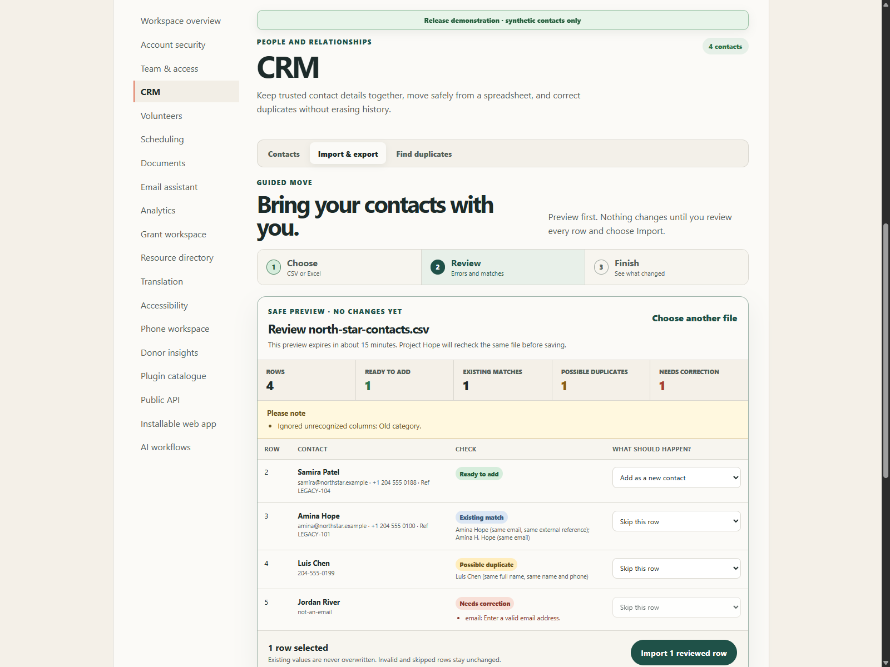
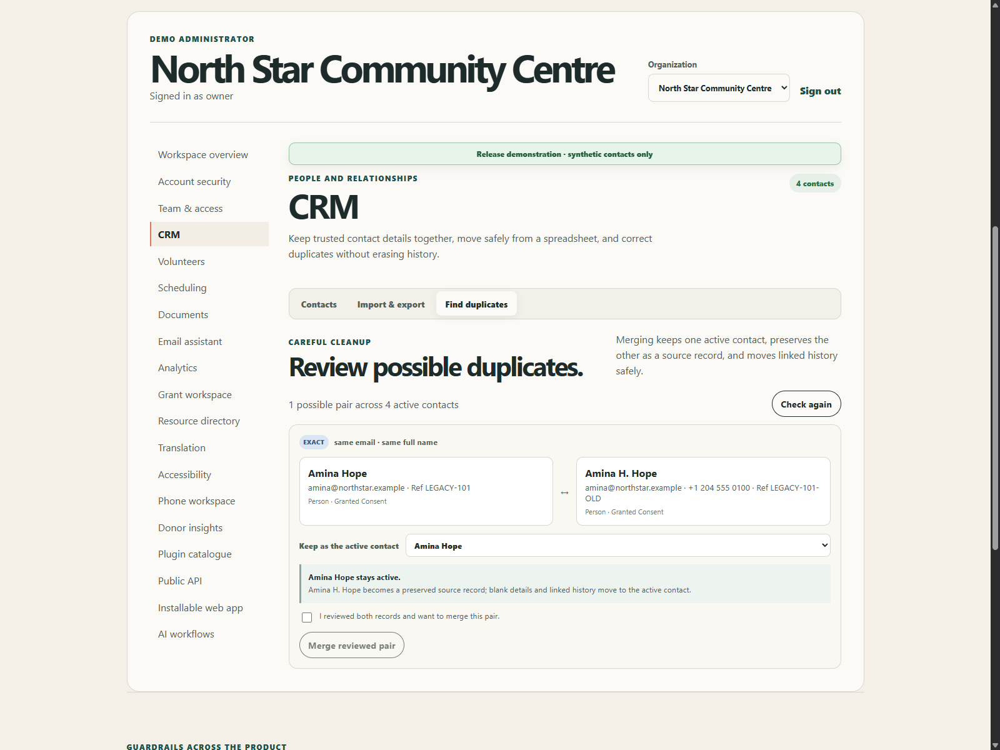
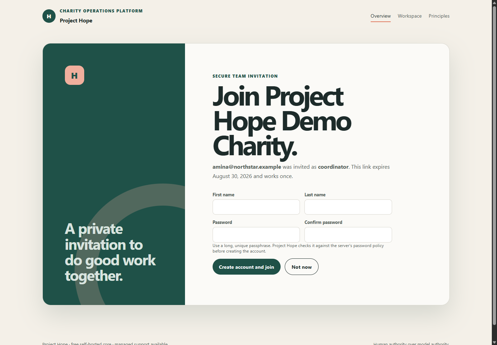
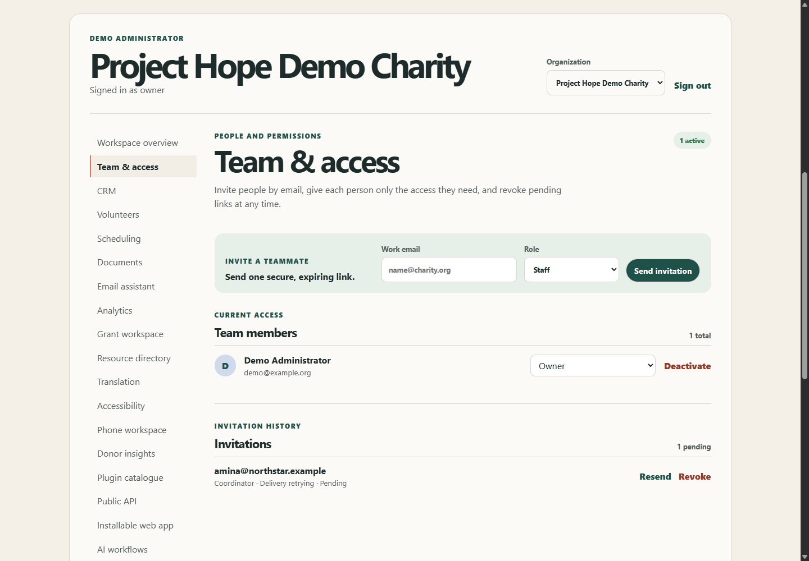
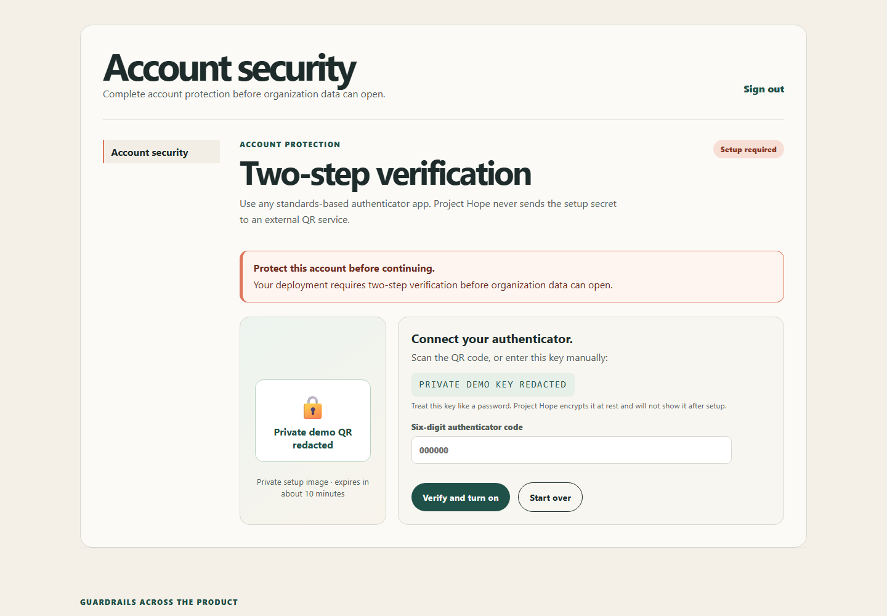
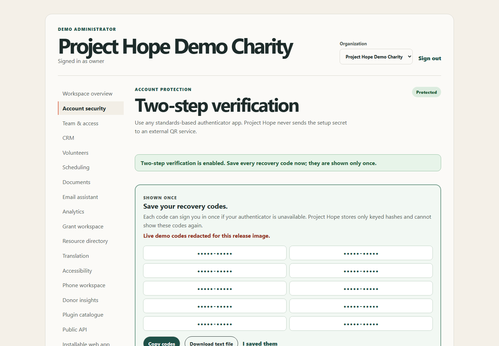

# Project Hope

### One calm workspace for the people doing the work.

[Explore Project Hope](https://project-hope-charities.vercel.app) · [Download the desktop preview](https://project-hope-charities.vercel.app/#download) · [Installation help](https://project-hope-charities.vercel.app/guide)

Project Hope gives charities one connected place to coordinate people, programs, volunteers, documents, schedules, grants, communications, and impact work.

Version 1.9 includes a working sample workspace inside the desktop app. Install it and explore fictional contacts, volunteers, schedules, and reviewable writing assistance—without an account, server address, Docker, or database setup. Sample edits persist on your computer.

The download is a preview, not an automatically provisioned managed charity account. Shared real-world use needs a separately hosted workspace. Generative AI needs compatible local models; otherwise the app clearly labels its limited safety templates. Installers are currently unsigned.


### Bring existing contacts without a blind import

| Review every spreadsheet row before saving | Preserve and merge reviewed duplicates |
|---|---|
|  |  |

Owners can use a normal Excel or CSV file, correct invalid rows, choose what happens to each match, and export the data again. The [plain-language contact migration guide](docs/MOVING_CONTACTS_FOR_CHARITIES.md) walks through the complete process without developer tools.

### Secure onboarding that feels like a normal app

| Private team invitation | Owner-managed team access |
|---|---|
|  |  |

### Built-in account protection





## Founding 10 managed pilot

Project Hope's source is publicly visible, but this repository does not yet include an approved software license, so reuse rights must not be assumed. The intended self-hosted Community offering is zero-cost once the copyright owner approves its licensing terms. The Founding 10 programme is for charities that want someone else to handle the technical launch and ongoing maintenance.

- **Founding Partner pilot:** CAD $149/month after the workspace is live
- **Included:** managed launch, first-admin onboarding, updates, encrypted backups, and human support
- **Pilot terms:** no setup fee, no charge to apply, no card collected during application, and cancel anytime
- **Data terms:** fit, scope, hosting region, and responsibilities are confirmed in writing before launch

The built-in application requires explicit consent, verifies every email, prevents duplicate applicants, and records privacy-safe funnel evidence. See the [commercial readiness runbook](docs/commercial-readiness.md) and [pilot privacy notice](docs/privacy/pilot-applications.md).

## Start here

| You are here for… | Go to… |
|---|---|
| Installing the app | [Download directly from the Project Hope website](https://project-hope-charities.vercel.app/#download) |
| Running the Founding 10 programme | [Commercial readiness and launch runbook](docs/commercial-readiness.md) |
| Moving contacts from a spreadsheet | [Move your contacts into Project Hope](docs/MOVING_CONTACTS_FOR_CHARITIES.md) |
| Announcing the release | [LinkedIn release post](docs/launch/linkedin-release-post.md) |
| Finding the first pilot partners | [Permission-first outreach kit](docs/launch/founding-10-outreach-kit.md) |
| Understanding the charity experience | [Project Hope as an app](docs/DISTRIBUTION_FOR_CHARITIES.md) |
| Deploying a workspace for a charity | [Production deployment guide](docs/operations/production-deployment.md) |
| Running a local training workspace | [Getting Started for Charities](docs/GETTING_STARTED_FOR_CHARITIES.md) |
| Reviewing what is built | [Full build status](docs/full-build-status.md) |

## The charity experience

1. Download the installer directly from the Project Hope website.
2. Install and open it; a fictional sample workspace prepares itself automatically.
3. Explore contacts, schedules, and writing assistance. Your local sample changes are saved.
4. When a hosted charity workspace is ready, choose “Connect my charity”, enter its website address, and then sign in.

Staff do not install Docker, configure databases, manage backups, learn developer commands, or maintain local copies of the system.

### Download the desktop app

The [download page](https://project-hope-charities.vercel.app/#download) offers verified installers and on-site installation guidance:

- **Windows:** one-click NSIS installer (`.exe`)
- **macOS:** Apple-silicon disk image (`.dmg`); not an Intel-Mac build
- **Linux:** AppImage and Debian package (`.AppImage`, `.deb`)

The generic installer now opens an included sample by default. It can also remember a separately hosted organization workspace. The connection screen needs a website address, not an email; account credentials come on the hosted sign-in screen.

ChromeOS and supported browsers can use the browser-installable version of a hosted workspace. Mobile-client foundations are included in the codebase, but App Store and Google Play releases are not available from this site.

## What is inside

- **Coordinate:** contacts with guided spreadsheet migration and duplicate cleanup, households, relationships, consent, volunteers, programs, events, shifts, waitlists, and calendar export.
- **Understand:** documents, bounded extraction, search, analytics, grants, evidence workflows, resources, translation, and donor insights.
- **Communicate safely:** minimized mailbox imports, injection flags, draft approval, email delivery, voice consent, callbacks, and transfer controls.
- **Extend responsibly:** governed plugins, scoped public API clients, capability tokens, append-only audit events, and human review.

The platform remains useful with AI disabled. AI features use bounded, replaceable adapters and keep consequential outputs reviewable by people.

## Built for trust

- Organization-scoped access, roles, permissions, audit history, and legal holds
- Built-in authenticator-app two-step verification, single-use recovery codes, encrypted MFA secrets, and automatic revocation of older sessions and app tokens after security changes
- Secure team onboarding with expiring one-time invitations, in-app role management, resend/revoke controls, and delivery retries
- Privacy-safe account recovery with one-hour single-use links and token/session invalidation
- Charity-controlled data with replaceable self-hosted infrastructure
- Human approval before consequential actions
- Accessible keyboard-first interfaces with reduced-motion support
- Safe upload handling, data minimization, and fail-closed production configuration
- Reviewed CSV/XLSX contact migration, spreadsheet formula protection, portable export, and source-preserving duplicate merges
- No paid AI API or cloud service is a required dependency
- The one-command local stack prepares a private Ollama chat model and semantic embedding model automatically; no AI account or API key is required.

## For setup partners

The setup partner owns the one-time technical launch:

- deploy the production Compose stack;
- connect the organization’s domain and HTTPS;
- configure the built-in MFA encryption key and shared security cache, plus email, secrets, backups, and monitoring;
- create the organization’s mobile build/signing configuration;
- run a synthetic-data staging test;
- build a preconfigured desktop installer.

On Windows, the preconfigured installer command is:

```powershell
.\scripts\build-desktop.ps1 -ServerUrl "https://hope.example.org"
```

Read the [desktop installer guide](apps/desktop/README.md) and [production deployment guide](docs/operations/production-deployment.md) before handing an installer to staff. Code-signing certificates and the real production workspace URL are intentionally organization-owned launch requirements.

## Local training workspace

The local stack is for training, demonstrations, and technical support. It is not the normal staff distribution path.

### Windows

Install [Docker Desktop](https://www.docker.com/products/docker-desktop/) or [Podman Desktop](https://podman-desktop.io/downloads), open it, then run:

```powershell
.\scripts\project-hope.ps1 setup
```

### macOS or Linux

```bash
bash scripts/project-hope.sh setup
```

The helper starts the local workspace, waits for health, opens the browser, and shows the demo sign-in. See [Getting Started for Charities](docs/GETTING_STARTED_FOR_CHARITIES.md) for the plain-language walkthrough.

## Developer workspace

The repository is organized as a modular monolith with replaceable clients:

| Area | Location |
|---|---|
| Domain API and workers | `services/core` |
| Web app and PWA shell | `apps/web` |
| Native mobile client | `apps/mobile` |
| Native desktop installers | `apps/desktop` |
| Compose and reverse proxy | `deploy/podman` |
| Architecture, operations, and decisions | `docs` |

### Web development

```powershell
cd apps/web
pnpm install
pnpm dev
```

The web shell runs at `http://127.0.0.1:5173/` and proxies `/api` to Django.

### API development

```powershell
cd services/core
python -m venv .venv
.\.venv\Scripts\Activate.ps1
pip install -r requirements-dev.txt
$env:DJANGO_SETTINGS_MODULE = "project.settings"
python manage.py migrate
python manage.py seed_demo
python manage.py runserver
```

### Verification

```powershell
cd services/core
python manage.py check
python manage.py test
ruff check project audit identity
mypy .

cd ..\..\apps\web
pnpm test
pnpm build

cd ..\desktop
pnpm install --frozen-lockfile
pnpm run build
```

GitHub Actions also verifies the backend, web client, mobile client, desktop packaging matrix, onboarding helpers, Compose files, and production configuration.

## Release status

The current public release is [Project Hope 1.8.0](https://github.com/Fink692/project-hope/releases/tag/v1.8.0), with guided and reversible contact migration, built-in two-step verification and recovery, secure team onboarding, native desktop installers, the local AI runtime, and the Founding 10 acquisition workflow. The [full build status](docs/full-build-status.md) records the implemented product surface and the remaining organization-owned launch requirements.

## Principles

- Charity-controlled data and replaceable infrastructure
- Human authority over model authority
- Explicit tenant and program scope
- Least privilege and append-only audit history
- Accessible interfaces and keyboard-first workflows
- Useful operations even when AI is disabled
